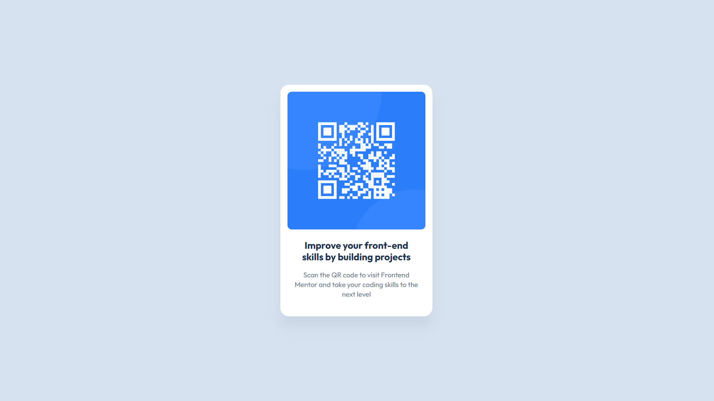

# Frontend Mentor - QR code component solution

This is a solution to the [QR code component challenge on Frontend Mentor](https://www.frontendmentor.io/challenges/qr-code-component-iux_sIO_H). Frontend Mentor challenges help you improve your coding skills by building realistic projects.

## Table of contents

- [Overview](#overview)
  - [Screenshot](#screenshot)
  - [Links](#links)
  - [Built with](#built-with)
  - [Useful resources](#useful-resources)
- [Author](#author)

## Overview

### Screenshot

### Links
- [Solution URL](https://github.com/molinax18/frontendmentor-challenges/tree/master/newbie/qr-code-component)

- [Live Site URL](https://your-live-site-url.com)

### Built with
- Semantic HTML5 markup
- CSS custom properties
- CSS Grid & Flexbox
- Normalize CSS
- Mobile-first workflow

### Useful resources
- [Normalize CSS page](https://necolas.github.io/normalize.css/) - Normalize CSS by Necolas. A great CSS formatter.

## Author
- Frontend Mentor - [@molinax18](https://www.frontendmentor.io/profile/molinax18)
